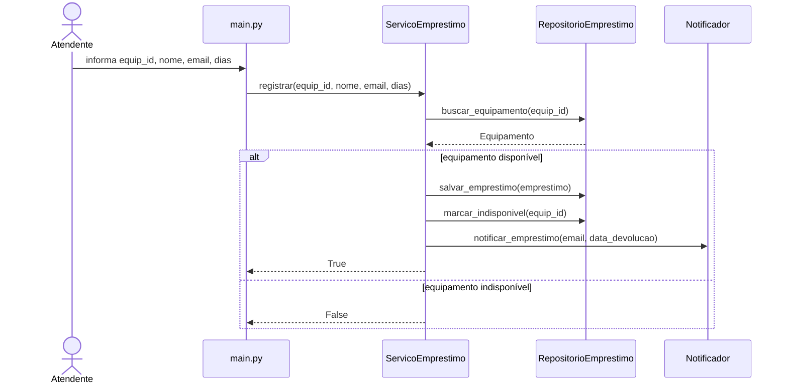
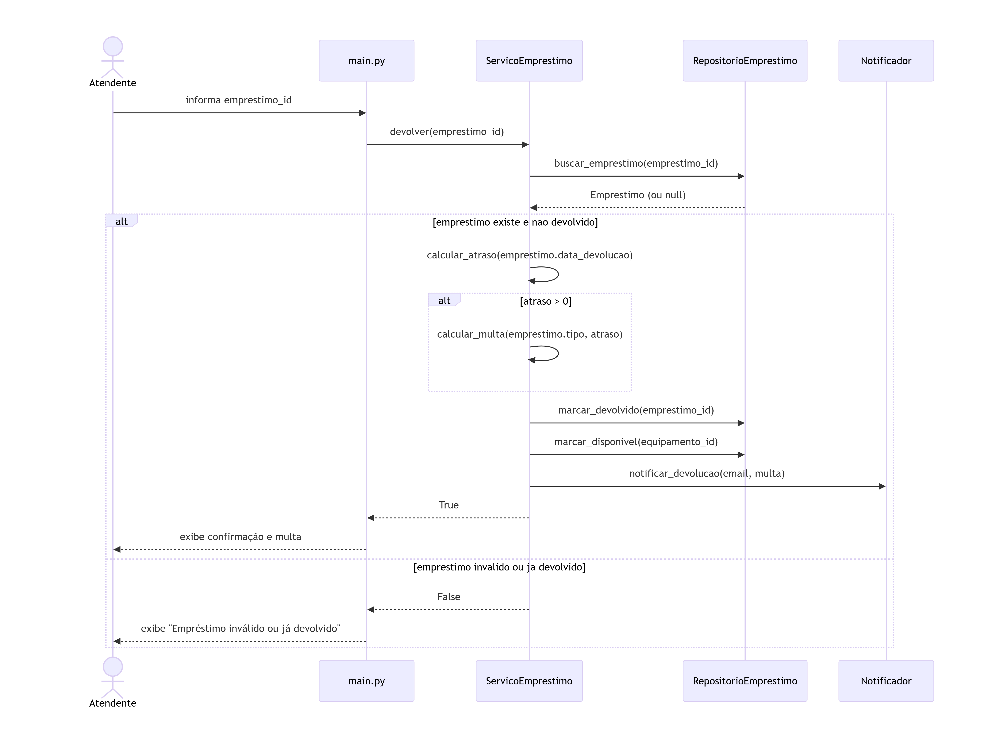
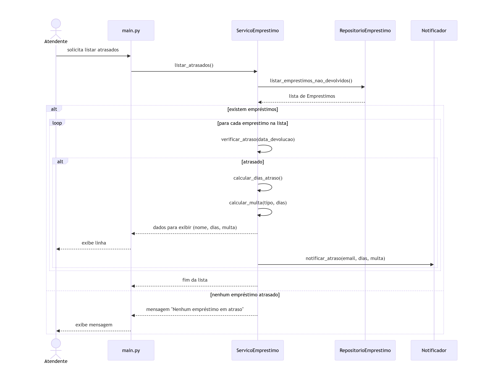

# Diagramas – Decomposição em camadas

## Decomposição em camadas

## Decomposição em camadas

### models/
- **Equipamento** – Alta coesão: representa exclusivamente os dados de um equipamento, ocultando seus atributos internos e sem dependências externas.
- **Emprestimo** – Mesmo princípio: estrutura os dados do empréstimo (datas, usuário, equipamento) sem conter lógica de negócio, facilitando a manutenção.

### services/
- **ServicoEmprestimo** – Centraliza todas as regras de negócio (registrar, devolver, calcular multa, listar atrasados). Isola essas regras da interface e da persistência, permitindo testes sem dependências externas. Baixo acoplamento porque depende apenas de interfaces de repositórios e do notificador.
- **Notificador** – Responsabilidade única: enviar mensagens (e-mail) para os usuários. Ao separar esta classe, aumentamos a coesão do sistema e reduzimos o acoplamento do serviço principal.

### repositories/
- **RepositorioEquipamento** – Oculta onde os dados dos equipamentos estão armazenados (lista, arquivo, banco). Qualquer mudança na persistência fica confinada a esta classe, sem afetar os serviços.
- **RepositorioEmprestimo** – Mesma justificativa para empréstimos. Ambos repositórios garantem baixo acoplamento com a lógica de negócio.

### main.py
- **main (função principal)** – Ponto de entrada do programa. Não é uma classe, mas atua como orquestrador: cria instâncias dos repositórios, do notificador e do serviço, injeta as dependências e executa o menu CLI. Sua coesão é propositalmente baixa, pois apenas configura o sistema, separando essa responsabilidade das demais camadas.

# Diagramas de Sequência

## Diagrama Mermaid para UC02

## Diagrama Mermaid para UC03
